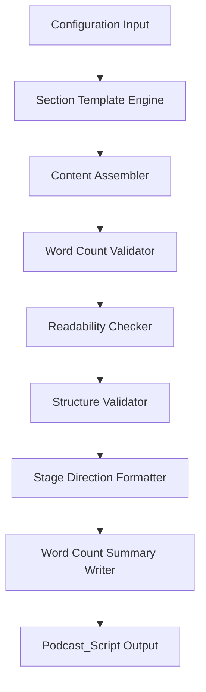

# Design Document — AI Evolution Podcast Script Generator

## Overview

The AI Evolution Podcast Script Generator is a content-generation system that produces a
two-minute, audio-ready podcast script on the topic of artificial intelligence history and
current trends. The system accepts lightweight configuration (title, tone overrides, optional
topic hints) and outputs a fully structured `Podcast_Script` artifact that is validated
against a defined set of structural, numeric, content, and readability constraints.

The output is a plain-text document divided into three clearly labelled sections — Intro,
Main Content, and Outro — followed by a word count summary block. It targets a general
audience with no assumed technical background and is formatted for comfortable host delivery.

---

## Architecture

The generator follows a **pipeline architecture**: each stage transforms or enriches the
script artifact and returns it to the next stage. Stages are discrete, testable units with
clear input/output contracts.



### Pipeline Stages

| Stage | Responsibility |
|---|---|
| Configuration Input | Parse and validate user-supplied options |
| Section Template Engine | Instantiate section templates for Intro, Main Content, Outro |
| Content Assembler | Fill templates with AI milestone and trend content |
| Word Count Validator | Assert per-section and total word counts are within spec |
| Readability Checker | Compute Flesch-Kincaid Grade Level; flag sentences that exceed grade 10 |
| Structure Validator | Assert ordering, headings, and list-free spoken sections |
| Stage Direction Formatter | Normalize all bracketed annotations to the allowed vocabulary |
| Word Count Summary Writer | Append the summary block to the end of the document |

---

## Components and Interfaces

### 1. ScriptConfig

Holds all generation parameters passed by the caller.

```
ScriptConfig {
  title:         String          // optional episode title
  topicHints:    String[]        // optional extra topics to weave in
  toneOverride:  Tone | null     // CONVERSATIONAL (default) | FORMAL
}
```

### 2. PodcastScript

The central data model produced and mutated by the pipeline.

```
PodcastScript {
  sections:     Section[]        // ordered: Intro, Main Content, Outro
  summaryBlock: WordCountSummary
}

Section {
  heading:  SectionHeading       // INTRO | MAIN_CONTENT | OUTRO
  body:     String               // spoken text (no lists)
  wordCount: Int
}

WordCountSummary {
  introWords:       Int
  mainContentWords: Int
  outroWords:       Int
  totalWords:       Int
}
```

### 3. SectionTemplateEngine

Produces blank `Section` scaffolds with placeholder tokens. Templates encode the
structural rules for each section type:

- **Intro template** — mandatory opening line (fixed string, prepended before all other
  content), hook slot, topic statement slot, transition slot (30–50 words)
- **Main Content template** — milestone slots (min 3), trend slots (min 2) (150–260 words)
- **Outro template** — theme summary slot, call-to-action slot (30–50 words)

The mandatory opening line is a fixed string constant defined in the content library:

```
MANDATORY_OPENING_LINE =
  "This is a pod cast on AI Evalution brought to you by Seri Charoensri on 7/06/2026, have fun!"
```

This constant is prepended verbatim as the first spoken text of every generated Intro
section. It is never modified, paraphrased, or regenerated.

### 4. ContentAssembler

Fills template placeholders using a curated content library of AI milestones and trends.
Responsible for:

- Selecting ≥ 3 milestones in chronological order with temporal context
- Selecting ≥ 2 current trends with plain-language explanations
- Ensuring contractions and conversational phrasing are used throughout
- Keeping individual sentence length ≤ 25 words

### 5. WordCountValidator

```
validate(script: PodcastScript): ValidationResult {
  errors: ValidationError[]
}
```

Checks:
- Total word count: 250–320
- Intro word count: 30–50
- Outro word count: 30–50
- Main Content word count: total − intro − outro

### 6. ReadabilityChecker

Computes the **Flesch-Kincaid Grade Level** for each section using:

```
FKGL = 0.39 × (words/sentences) + 11.8 × (syllables/words) − 15.59
```

Flags any section where FKGL > 10. Also flags any sentence with word count > 25.

### 7. StructureValidator

Verifies:
- Exactly three sections are present
- Headings match the canonical labels (`[INTRO]`, `[MAIN CONTENT]`, `[OUTRO]`)
- Section order is Intro → Main Content → Outro (by array index)
- No spoken-section body contains list markers (`-`, `*`, `•`, or `1.`…)
- The Intro section body begins with the exact `MANDATORY_OPENING_LINE` constant as its
  first spoken text; emits `MISSING_OPENING_LINE` if absent or altered

### 8. StageDirectionFormatter

Normalises all bracketed tokens. The allowed vocabulary is:

| Token | Meaning |
|---|---|
| `[INTRO]` | Section heading |
| `[MAIN CONTENT]` | Section heading |
| `[OUTRO]` | Section heading |
| `[PAUSE]` | Recommended delivery pause |
| `[EMPHASIS]` | Recommended vocal emphasis |

Any token outside this vocabulary is flagged as a formatting error.

---

## Data Models

### ContentLibrary

A static, curated dataset embedded in the system. Not generated at runtime.

```
AIMilestone {
  year:        Int       // e.g. 1956
  decade:      String    // e.g. "1950s"
  label:       String    // short name, e.g. "Dartmouth Conference"
  description: String    // 1–2 spoken sentences in plain language
}

AITrend {
  label:       String    // e.g. "Large Language Models"
  plainExpl:   String    // plain-language explanation, ≤ 25 words per sentence
  examples:    String[]  // optional: "GPT-4", "Gemini"
}
```

**Minimum required milestones in the library (seed data):**

| Year | Label |
|---|---|
| 1956 | Dartmouth Conference |
| 1997 | Deep Blue defeats Kasparov |
| 2012 | AlexNet deep learning breakthrough |
| 2017 | Transformer architecture introduced |
| 2022 | ChatGPT public release |

**Minimum required trends in the library (seed data):**

| Label |
|---|
| Large Language Models |
| Generative AI |
| AI in Healthcare |
| AI in Creative Fields |

### ValidationResult

```
ValidationResult {
  passed:  Boolean
  errors:  ValidationError[]
}

ValidationError {
  code:    ErrorCode
  section: SectionHeading | null
  message: String
}
```

**Error codes:**

| Code | Description |
|---|---|
| `WORD_COUNT_OUT_OF_RANGE` | Section or total word count outside allowed range |
| `MISSING_SECTION` | Expected section not present |
| `WRONG_SECTION_ORDER` | Sections appear in wrong order |
| `INVALID_HEADING` | Section heading does not match canonical label |
| `LIST_IN_SPOKEN_SECTION` | List marker found inside spoken text |
| `INVALID_STAGE_DIRECTION` | Unknown bracketed token |
| `READABILITY_EXCEEDED` | FKGL > 10 for a section |
| `SENTENCE_TOO_LONG` | Sentence exceeds 25 words |
| `YEAR_IN_INTRO` | Four-digit year found in the Intro section |
| `MISSING_TEMPORAL_CONTEXT` | Milestone mentioned without year/decade |
| `MILESTONES_NOT_CHRONOLOGICAL` | Milestone years not in ascending order |
| `MISSING_OPENING_LINE` | Intro does not begin with the mandatory opening line |

---

## Correctness Properties

*A property is a characteristic or behavior that should hold true across all valid executions
of a system — essentially, a formal statement about what the system should do. Properties
serve as the bridge between human-readable specifications and machine-verifiable correctness
guarantees.*

### Property 1: Three-section structure invariant

*For any* valid `ScriptConfig`, the generated `PodcastScript` SHALL contain exactly three
sections, labelled `[INTRO]`, `[MAIN CONTENT]`, and `[OUTRO]`, in that order.

**Validates: Requirements 1.1, 1.2, 1.3**

---

### Property 2: Per-section and total word count bounds

*For any* generated `PodcastScript`, the Intro section word count SHALL be in [30, 50],
the Outro section word count SHALL be in [30, 50], and the total word count SHALL be in
[250, 320]. The Main Content word count equals total minus intro minus outro.

**Validates: Requirements 2.1, 2.3, 2.4, 2.5**

---

### Property 3: Word count summary is always present

*For any* generated `PodcastScript`, a word count summary block SHALL appear at the end
of the document, reporting the word count for each section and the total.

**Validates: Requirements 2.2**

---

### Property 4: Milestone temporal context

*For any* generated `PodcastScript`, every AI milestone referenced in the Main Content
SHALL be accompanied by a year (four-digit integer) or a decade string (e.g. "1990s")
within the same or immediately adjacent sentence.

**Validates: Requirements 3.2**

---

### Property 5: Milestones appear in chronological order

*For any* generated `PodcastScript`, all year and decade references in the Main Content
SHALL appear in strictly ascending chronological order.

**Validates: Requirements 3.3**

---

### Property 6: Intro contains no year references

*For any* generated `PodcastScript`, the Intro section body SHALL contain no four-digit
year patterns, ensuring detailed historical facts are reserved for the Main Content.

**Validates: Requirements 6.3**

---

### Property 7: Topic stated in the Intro opening

*For any* generated `PodcastScript`, at least one of the first three sentences in the Intro
SHALL contain a keyword related to the episode topic ("AI", "artificial intelligence",
"intelligence").

**Validates: Requirements 6.2**

---

### Property 8: Readability bound per section

*For any* generated `PodcastScript`, the Flesch-Kincaid Grade Level for each of the three
sections SHALL be ≤ 10, and no individual sentence SHALL exceed 25 words.

**Validates: Requirements 5.3, 8.3**

---

### Property 9: No list markers in spoken sections

*For any* generated `PodcastScript`, none of the spoken-section bodies SHALL contain lines
beginning with list-marker characters (`-`, `*`, `•`) or numeric list patterns (`1.`, `2.`,
etc.).

**Validates: Requirements 8.1**

---

### Property 10: Stage directions use only the allowed vocabulary

*For any* generated `PodcastScript`, every bracketed token in the document SHALL be one of
the five allowed tokens: `[INTRO]`, `[MAIN CONTENT]`, `[OUTRO]`, `[PAUSE]`, `[EMPHASIS]`.

**Validates: Requirements 8.2**

---

### Property 11: Mandatory opening line is always the first spoken text

*For any* generated `PodcastScript`, the Intro section body SHALL begin with the exact
string `"This is a pod cast on AI Evalution brought to you by Seri Charoensri on 7/06/2026, have fun!"` as its very first spoken text. No other content, whitespace prefix (beyond
trimming), or paraphrase may precede it.

**Validates: Requirements 9.1, 9.2, 9.3**

---

## Error Handling

| Failure Point | Behaviour |
|---|---|
| Word count out of range | `WordCountValidator` returns `WORD_COUNT_OUT_OF_RANGE`; pipeline halts and surfaces the error to the caller with the section name and actual count |
| FKGL > 10 | `ReadabilityChecker` flags the offending section and sentences; pipeline reports `READABILITY_EXCEEDED` and `SENTENCE_TOO_LONG` errors |
| Unknown stage direction token | `StageDirectionFormatter` flags `INVALID_STAGE_DIRECTION` with the offending token |
| Missing or out-of-order section | `StructureValidator` returns `MISSING_SECTION` or `WRONG_SECTION_ORDER` |
| Year found in Intro | `StructureValidator` returns `YEAR_IN_INTRO` |
| Milestone without temporal context | `ContentAssembler` returns `MISSING_TEMPORAL_CONTEXT` before pipeline proceeds |
| Milestones not in order | `ContentAssembler` returns `MILESTONES_NOT_CHRONOLOGICAL` |
| Intro missing mandatory opening line | `StructureValidator` returns `MISSING_OPENING_LINE` |

All errors aggregate into a `ValidationResult`. The pipeline does **not** perform partial
delivery — the caller receives either a fully valid `PodcastScript` or a `ValidationResult`
with a non-empty `errors` list.

---

## Testing Strategy

### Dual Testing Approach

The testing strategy combines **example-based unit tests** for specific scenarios and
**property-based tests** (PBT) for universal invariants that must hold across all generated
scripts. Both layers are required for full confidence in generator correctness.

### Property-Based Testing

**Library**: [fast-check](https://github.com/dubzzz/fast-check) (TypeScript/JavaScript) or
[Hypothesis](https://hypothesis.readthedocs.io/) (Python), depending on implementation
language. Do not implement PBT from scratch.

**Minimum iterations per property test**: 100

**Tag format for each PBT test**:
`Feature: ai-evolution-podcast, Property {N}: {property_text}`

Each property listed in the Correctness Properties section above maps to a single PBT test.
Generators should produce:

- Random `ScriptConfig` objects with varying title strings and optional topic hints
- Random word counts (for testing boundary conditions of the validator)
- Random sentence strings (for testing readability and sentence-length checkers)
- Random `Section` arrays with permuted order (for testing structure validation)
- Random bracketed token strings (for testing stage direction validation)

### Unit Tests (Example-Based)

Focus unit tests on:

- **Milestone count**: A generated script contains at least 3 distinct milestone references
  (Requirement 3.1)
- **Trend count**: A generated script contains at least 2 trend references (Requirement 4.1)
- **Trend explanation**: Each trend is followed by a plain-language explanation
  (Requirement 4.2)
- **Technical term glossing**: Known jargon terms (e.g. "neural network", "large language
  model") are followed by an explanation on first use (Requirement 5.1)
- **Intro hook detection**: The first sentence of the Intro is a question or a short punchy
  statement (Requirement 6.1)
- **Outro call-to-action**: The Outro contains at least one imperative or CTA phrase
  (Requirement 7.2)
- **Outro theme summary**: The Outro contains at least one sentence (Requirement 7.1)

### Integration Tests

- End-to-end generation with default `ScriptConfig` produces a fully valid `PodcastScript`
  (all validators pass, all sections present, summary block appended)
- End-to-end generation with a `topicHints` override still satisfies all structural
  constraints

### What Is Not Tested Programmatically

- **Conversational tone** (Requirement 5.2): subjective; requires editorial review
- **Outro introduces no new facts** (Requirement 7.3): requires semantic understanding;
  editorial review only

---

*End of Design Document*
